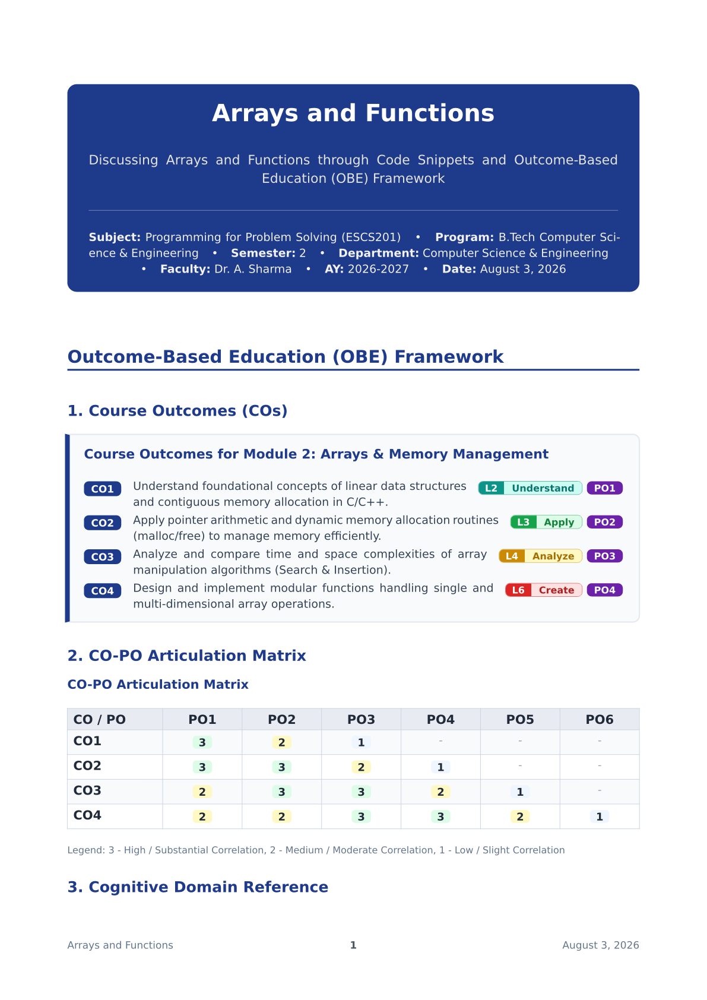
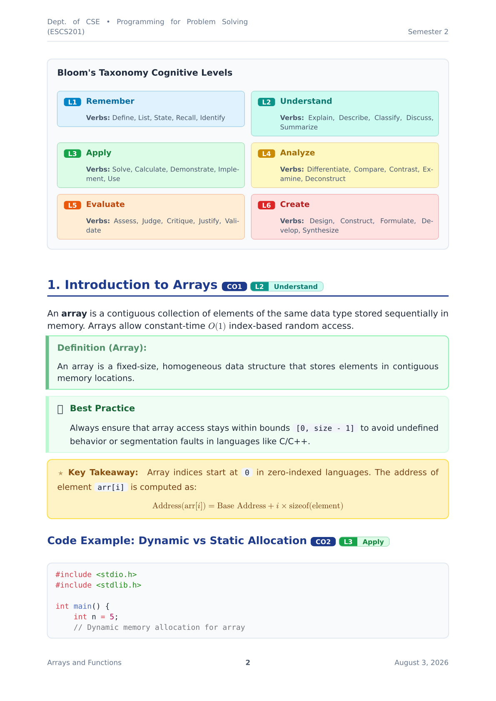
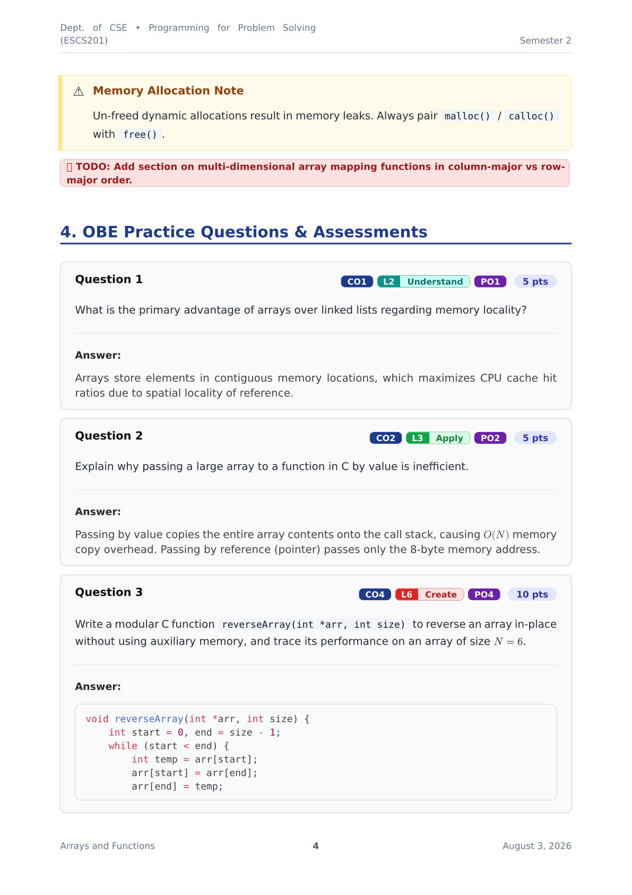
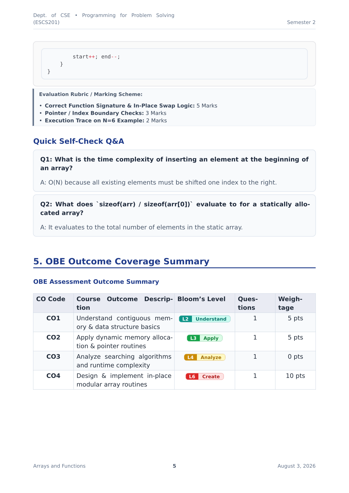

# class-note 📝

A clean, modern, and rich academic lecture note template for [Typst](https://typst.app/). Designed for students, researchers, and educators who want structured, beautifully formatted notes with built-in support for mathematical environments, callouts, questions and answers, code blocks, and **Outcome-Based Education (OBE)** standards.

---

## 📸 Preview

<div align="center">
  <p><strong>Outcome-Based Education (OBE) Framework & CO-PO Articulation Matrix</strong></p>
  
  <br /><br />
  <p><strong>Bloom's Taxonomy Guide, Section Tags & Lecture Notes</strong></p>
  
  <br /><br />
  <p><strong>OBE-Tagged Practice Questions & Marking Rubrics</strong></p>
  
  <br /><br />
  <p><strong>OBE Assessment Outcome Summary Table</strong></p>
  
</div>

---

## ✨ Features

- 🎨 **Hero Card & Header Banner**: Elegant document header with customizable title, subtitle, faculty, course code, department, degree program, academic year, semester, and date.
- 🎓 **Outcome-Based Education (OBE) Support**: Native components for Course Outcomes (COs), Program Outcomes (POs), Bloom's Taxonomy levels (L1–L6), CO-PO Articulation Matrices, marking rubrics, and assessment summaries.
- 📐 **Theorem & Math Environments**: Built-in support for `#theorem`, `#lemma`, `#proposition`, `#corollary`, `#definition`, `#example`, and `#proof` (with auto Q.E.D. $square$ symbol).
- 💬 **Rich Callouts**: Built-in callout cards for `#callout(type: "info" | "tip" | "warning" | "important" | "note")` as well as custom background colors.
- ❓ **Question & Answer Cards**: Structured `#question` & `#obe-question` blocks with optional points, CO/Bloom tags, marking rubrics, and answers, plus `#qna` helper lists.
- 📌 **Key Takeaways & TODOs**: `#keypoint` boxes for highlighting core concepts and inline `#todo` badges for lecture note action items.
- 💻 **Syntax Highlighted Code & Styled Tables**: Modern block & inline raw code styling and automatic alternating-row table styling.
- 📄 **Clean Headers & Footers**: Automatic page numbering, subject running header on pages after the first page, and document title running footer.

---

## 🚀 Quick Start

Import `classnotes.typ` into your document:

```typst
#import "classnotes.typ": *

#show: classnote.with(
  title: "Arrays and Functions",
  subtitle: "Discussing Arrays and Functions through Code Snippets and OBE Framework",
  faculty: "Dr. A. Sharma",
  program: "B.Tech Computer Science & Engineering",
  semester: 2,
  dept_short: "CSE",
  dept: "Computer Science & Engineering",
  subject: "Programming for Problem Solving",
  code: "ESCS201",
  academic_year: "2026-2027",
  date: "August 3, 2026",
  accent: rgb("#1e3a8a"),
)

= Outcome-Based Education (OBE) Framework

#course-outcomes(
  cos: (
    (code: "CO1", desc: "Understand contiguous memory structures.", bloom: "L2", po: "PO1"),
    (code: "CO2", desc: "Apply dynamic memory allocation routines.", bloom: "L3", po: "PO2"),
  )
)

= 1. Introduction #obe-tag(co: "CO1", bloom: "L2")

#definition(term: "Array")[
  An array is a contiguous block of memory holding homogenous elements.
]

#question(
  [What is the spatial complexity of static array allocation?],
  co: "CO1",
  bloom: "L2 - Understand",
  po: "PO1",
  answer: [$O(1)$ auxiliary space beyond the allocated memory block.],
  points: 5
)
```

---

## 📑 Component Reference

### 1. Main Document Template (`#classnote`)

| Parameter | Type | Default | Description |
| :--- | :--- | :--- | :--- |
| `title` | `str` | `""` | Document main title |
| `subtitle` | `str` | `""` | Optional subtitle or topic description |
| `faculty` | `str` | `""` | Instructor / Professor name |
| `program` | `str` | `""` | Degree program (e.g. `"B.Tech CSE"`) |
| `semester` | `str` / `int` | `""` | Semester number or label |
| `academic_year` | `str` | `""` | Academic Year (e.g. `"2026-2027"`) |
| `dept_short` | `str` | `""` | Department abbreviation (e.g. `"CSE"`) |
| `dept` | `str` | `""` | Full department name |
| `subject` | `str` | `""` | Course / Subject name |
| `code` | `str` | `""` | Course code (e.g. `"ESCS201"`) |
| `date` | `str` / `content` | `""` | Lecture date |
| `accent` | `color` / `str` | `rgb("#1e3a8a")` | Primary theme accent color |
| `paper` | `str` | `"a4"` | Paper size |
| `font` | `array` / `str` | `("DejaVu Sans", ...)` | Font family fallback list |

---

### 2. Outcome-Based Education (OBE) Components

#### Course Outcomes Box (`#course-outcomes`)
```typst
#course-outcomes(
  title: "Course Outcomes (COs)",
  cos: (
    (code: "CO1", desc: "Understand array memory layout.", bloom: "L2", po: "PO1"),
    (code: "CO2", desc: "Apply dynamic memory routines.", bloom: "L3", po: "PO2"),
  )
)
```

#### CO-PO Articulation Matrix (`#co-po-matrix`)
```typst
#co-po-matrix(
  cos: ("CO1", "CO2", "CO3"),
  pos: ("PO1", "PO2", "PO3", "PO4"),
  mapping: (
    (3, 2, 1, "-"),
    (3, 3, 2, 1),
    (2, 3, 3, 2),
  )
)
```

#### Bloom's Taxonomy Badges (`#bloom-badge` & `#obe-tag`)
```typst
// Single Bloom badge (L1 to L6)
#bloom-badge("L3 - Apply")

// Combined OBE Tag (CO + Bloom + PO)
#obe-tag(co: "CO1", bloom: "L2", po: "PO1")
```

#### Bloom's Taxonomy Visual Reference (`#bloom-legend`)
```typst
#bloom-legend()
```

#### OBE Question & Evaluation Rubric (`#obe-question`)
```typst
#obe-question(
  [Implement an in-place array reversal function in C.],
  co: "CO4",
  bloom: "L6 - Create",
  po: "PO4",
  points: 10,
  rubric: [
    - *In-Place Swap Logic:* 5 Marks
    - *Boundary Checks:* 3 Marks
    - *Execution Trace:* 2 Marks
  ],
  answer: [ ... ]
)
```

#### OBE Assessment Outcome Summary (`#obe-summary`)
```typst
#obe-summary(
  items: (
    (co: "CO1", desc: "Understand contiguous memory basics", bloom: "L2", questions: 1, marks: 5),
    (co: "CO2", desc: "Apply dynamic memory allocation", bloom: "L3", questions: 1, marks: 5),
  )
)
```

---

### 3. Theorems & Proofs

```typst
#theorem(title: "Theorem Name")[ Theorem statement... ]
#lemma(title: "Lemma Name")[ Lemma statement... ]
#proposition(title: "Proposition Name")[ Proposition statement... ]
#corollary(title: "Corollary Name")[ Corollary statement... ]
#definition(term: "Term Name")[ Definition statement... ]
#example(title: "Example Title")[ Example description... ]
#proof[ Proof steps... ]
```

---

### 4. Callouts & Notes

```typst
#callout(type: "info", title: "Information")[ ... ]
#callout(type: "tip", title: "Pro Tip")[ ... ]
#callout(type: "warning", title: "Caution")[ ... ]
#callout(type: "important", title: "Critical")[ ... ]
#callout(type: "note", title: "Note")[ ... ]
```

---

### 5. Questions & Answers

```typst
// Question card with optional OBE parameters
#question(
  [What is the time complexity of Binary Search?],
  co: "CO1",
  bloom: "L2",
  answer: [$O(\log N)$],
  points: 5
)

// Q&A List helper
#qna(items: (
  (question: "What is an array?", answer: "A contiguous memory block of homogenous elements."),
))
```

---

### 6. Key Points & Action Items

```typst
#keypoint[ Key formula or core takeaway to remember! ]
#todo("Complete problem set #3 before next lecture")
```

---

## 🛠 Compilation

To compile your notes into a PDF using the Typst CLI:

```bash
typst compile main.typ output.pdf
```

To enable live re-compilation on file save:

```bash
typst watch main.typ output.pdf
```

---

## 📄 License

This template is licensed under the [MIT-0 License](LICENSE).
